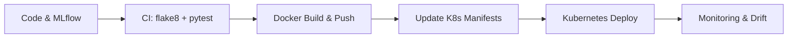

# 🚀 MLOps Project


End‑to‑end ML pipeline with MLflow tracking, CI quality gates, Dockerized services, Kubernetes deploys, and production drift monitoring. 

---

## 🔍 Overview

- 🧠 Backend: feature engineering, preprocessing, and API serving.
- 🖥️ Frontend: simple UI to interact with the model/service.
- 📚 Tracking: MLflow hosted on DagsHub.
- ✅ CI: lint/tests • 🚢 CD: Docker build/push + K8s deploy.
- 🔎 Monitoring: drift checks and HTML reports.

---

## 🧭 Architecture



---

## 🧩 Components

- Backend: [backend/src/api.py](backend/src/api.py) • [backend/src/preprocessing.py](backend/src/preprocessing.py) • [backend/src/feature_store.py](backend/src/feature_store.py)
- Frontend: [frontend/app.py](frontend/app.py)
- Monitoring: [monitoring/check_drift.py](monitoring/check_drift.py) • [monitoring/monitor_production.ipynb](monitoring/monitor_production.ipynb) • [monitoring/production_drift_report.html](monitoring/production_drift_report.html)
- Pipeline: [Jenkinsfile](Jenkinsfile)

---

## 🧪 Experiment Tracking (MLflow + DagsHub)

- Tracking URI: https://dagshub.com/YomnaJL/MLOPS_Project.mlflow
- Credentials: `DAGSHUB_TOKEN` (Jenkins), repo/user configured in pipeline env.
- Local runs may write to [backend/mlruns](backend/mlruns).

---

## 🧷 CI/CD Pipeline (Jenkins)

- Initialize: checkout `main`, compute `GIT_COMMIT_HASH`.
- CI: create venv on `python:3.9-slim`, install deps, run `flake8` + `pytest`.
- Docker Login: use Jenkins `docker-hub-credentials`.
- Build & Push: backend (`./backend/src`) and frontend (`./frontend`) images → tags `-${BUILD_NUMBER}`, `-${GIT_COMMIT_HASH}`, `-latest` under `imen835/mlops-crime`.
- Update Manifests: replace `REPLACE_ME_*` image placeholders in `k8s/*`.
- Deploy: `kubectl apply` with `kubeconfig-secret`, quick `kubectl get pods`.

---

## 💻 Run Locally (Windows)

```powershell
# Backend
docker build -t imen835/mlops-crime:backend-local ./backend/src
docker run --rm -p 8000:8000 imen835/mlops-crime:backend-local

# Frontend
docker build -t imen835/mlops-crime:frontend-local ./frontend
docker run --rm -p 8501:8501 imen835/mlops-crime:frontend-local

# Monitoring
python -m venv .venv
.\.venv\Scripts\Activate.ps1
pip install --upgrade pip
python monitoring/check_drift.py
```

---

## ☸️ Kubernetes Deployment

```powershell
kubectl apply -f k8s/backend-deployment.yml
kubectl apply -f k8s/frontend-deployment.yml
kubectl get pods -A
```

---

## 🔎 Monitoring & Drift

- Generate drift: run [monitoring/check_drift.py](monitoring/check_drift.py)
- View report: [monitoring/production_drift_report.html](monitoring/production_drift_report.html)
- Explore notebook: [monitoring/monitor_production.ipynb](monitoring/monitor_production.ipynb)

---

## 📚 Resources

- MLflow: https://mlflow.org/docs/latest/index.html
- DagsHub MLflow: https://dagshub.com/docs/integration/mlflow/
- Jenkins: https://www.jenkins.io/doc/book/pipeline/
- Docker: https://docs.docker.com/
- Kubernetes: https://kubernetes.io/docs/home/
- PyTest: https://docs.pytest.org/
- Flake8: https://flake8.pycqa.org/

---

## 📄 License

Educational and practical MLOps demo. Ensure compliance with external assets.

A production‑ready MLOps setup that covers the lifecycle from feature engineering and model tracking to continuous integration, containerization, deployment, and drift monitoring. This repository is organized into three main components (backend, frontend, monitoring) and orchestrated by a Jenkins pipeline that builds, tests, packages, and deploys to Kubernetes.

---

## Overview

- Backend services for feature engineering, preprocessing, and API serving.
- Frontend app for interfacing with the model/service.
- ML experimentation tracked with MLflow (hosted on DagsHub).
- CI (quality checks + tests) and CD (Docker build/push + Kubernetes deploy) via Jenkins.
- Production monitoring and data drift checks with reports.

---

## Repository Structure

- [backend](backend)
	- [src/api.py](backend/src/api.py): Model API and service endpoints.
	- [src/preprocessing.py](backend/src/preprocessing.py): Data cleaning and transformation utilities.
	- [src/feature_store.py](backend/src/feature_store.py): Feature store access and management helpers.
	- [src/Dockerfile](backend/src/Dockerfile): Backend container image definition.
	- [src/requirements-backend.txt](backend/src/requirements-backend.txt): Python dependencies for backend.
	- [mlruns](backend/mlruns): MLflow local store (artifacts/metrics when run locally).
- [frontend](frontend)
	- [app.py](frontend/app.py): Frontend application entrypoint.
	- [Dockerfile](frontend/Dockerfile): Frontend container image definition.
	- [requirements-frontend.txt](frontend/requirements-frontend.txt): Python dependencies for frontend.
- [monitoring](monitoring)
	- [check_drift.py](monitoring/check_drift.py): Drift detection script for production data.
	- [monitor_production.ipynb](monitoring/monitor_production.ipynb): Notebook for monitoring workflows.
	- [production_drift_report.html](monitoring/production_drift_report.html): HTML drift report output.
- [Jenkinsfile](Jenkinsfile): CI/CD pipeline (build, test, package, deploy).
- `k8s/`: Kubernetes manifests (referenced by Jenkins during deployment).

---

## Architecture

High‑level flow from development to production:

1. Experiment & Develop
	 - Implement preprocessing and features in `backend/src/preprocessing.py` and `backend/src/feature_store.py`.
	 - Track experiments (params, metrics, artifacts) with MLflow pointing to DagsHub.
2. CI Quality & Tests (Jenkins)
	 - Linting with `flake8` and tests with `pytest`.
	 - Ensures code quality before packaging.
3. Containerize & Push
	 - Build Docker images for backend and frontend.
	 - Push images to Docker Hub with multiple tags (build number, commit hash, latest).
4. Configure Manifests
	 - Replace placeholders in Kubernetes deployment YAML with freshly built image tags.
5. Deploy to Kubernetes
	 - Apply manifests and verify pods are running.
6. Monitor in Production
	 - Run drift checks and generate monitoring reports.

---

## ML Experiment Tracking (MLflow on DagsHub)

- Tracking URI (from Jenkins environment):
	- `MLFLOW_TRACKING_URI = https://dagshub.com/YomnaJL/MLOPS_Project.mlflow`
- Related configuration:
	- `DAGSHUB_USERNAME = YomnaJL`
	- `DAGSHUB_REPO_NAME = MLOPS_Project`
	- `DAGSHUB_TOKEN` (stored as a Jenkins credential `daghub-credentials`).
- Local runs write into [backend/mlruns](backend/mlruns). When pointing to DagsHub, runs and artifacts are synced to remote.

---

## CI/CD Pipeline (Jenkins)

Defined in [Jenkinsfile](Jenkinsfile). Stages:

- Initialize
	- Checkout repository from GitHub (`main` branch`).
	- Compute short commit hash (`GIT_COMMIT_HASH`) for tagging images.

- CI: Quality & Tests
	- Use `python:3.9-slim` to create a virtualenv.
	- Install backend deps from [backend/src/requirements-backend.txt](backend/src/requirements-backend.txt) and tooling (`pytest`, `flake8`, `pytest-cov`).
	- Lint: `flake8 backend/src ...` (errors shown without failing the pipeline).
	- Tests: `pytest testing/` (expected project tests live under a `testing/` folder).

- Docker Login
	- Logs in to Docker Hub using the Jenkins credential `docker-hub-credentials`.

- CD: Build & Push Images
	- Backend image context: `./backend/src` → tags: `backend-${BUILD_NUMBER}`, `backend-${GIT_COMMIT_HASH}`, `backend-latest`.
	- Frontend image context: `./frontend` → tags: `frontend-${BUILD_NUMBER}`, `frontend-${GIT_COMMIT_HASH}`, `frontend-latest`.
	- Base name: `DOCKER_IMAGE_NAME = imen835/mlops-crime`.

- Update Manifests
	- Replace `REPLACE_ME_BACKEND_IMAGE` and `REPLACE_ME_FRONTEND_IMAGE` placeholders in `k8s/*-deployment.yml` with current tags.

- Deploy to Kubernetes
	- Use `kubeconfig-secret` to authenticate.
	- `kubectl apply -f k8s/backend-deployment.yml` and `kubectl apply -f k8s/frontend-deployment.yml`.
	- Quick health check: `kubectl get pods`.

- Post
	- Cleanup Docker images and logout.
	- Clear messaging on success/failure.

---

## Secrets & Environment

Managed by Jenkins credentials and environment block:

- Docker Hub: `DOCKERHUB_CREDS` (`docker-hub-credentials`).
- DagsHub: `DAGSHUB_TOKEN` (`daghub-credentials`).
- Kubernetes: `kubeconfig-secret` (file credential with KUBECONFIG).
- Static config used by the pipeline:
	- `DOCKER_IMAGE_NAME = imen835/mlops-crime`
	- `DAGSHUB_USERNAME = YomnaJL`
	- `DAGSHUB_REPO_NAME = MLOPS_Project`
	- `MLFLOW_TRACKING_URI = https://dagshub.com/YomnaJL/MLOPS_Project.mlflow`

---

## Run Locally (Windows)

Recommended to use Docker for consistent environments.

- Backend (Docker):

```powershell
# From repo root
docker build -t imen835/mlops-crime:backend-local ./backend/src
# Run the container; expose the API port configured in api.py or the Dockerfile
# Example (adjust port as needed):
docker run --rm -p 8000:8000 imen835/mlops-crime:backend-local
```

- Frontend (Docker):

```powershell
# From repo root
docker build -t imen835/mlops-crime:frontend-local ./frontend
# Expose the frontend port configured in app.py or the Dockerfile
# Example (adjust port as needed):
docker run --rm -p 8501:8501 imen835/mlops-crime:frontend-local
```

- Monitoring (Local Python):

```powershell
# Create and activate a venv (PowerShell)
python -m venv .venv
.\.venv\Scripts\Activate.ps1
pip install --upgrade pip
# Install any required packages as needed (see scripts or reuse backend/frontend reqs)
# Run drift check
python monitoring/check_drift.py
```

> Tip: If running Python directly for backend/frontend, install dependencies from the respective requirements files and follow the entrypoints in [backend/src/api.py](backend/src/api.py) and [frontend/app.py](frontend/app.py). Docker remains the most reproducible path.

---

## Kubernetes Deployment

- Ensure the `k8s/` manifests contain placeholders `REPLACE_ME_BACKEND_IMAGE` and `REPLACE_ME_FRONTEND_IMAGE`.
- Jenkins replaces these with the latest build tags during the `Update Manifests` stage.
- Deploys happen via `kubectl apply` using a provided `KUBECONFIG` credential.

For manual deploys (example):

```powershell
# Ensure images exist in Docker Hub with proper tags
kubectl apply -f k8s/backend-deployment.yml
kubectl apply -f k8s/frontend-deployment.yml
kubectl get pods -A
```

---

## Development Guidelines

- Keep preprocessing, feature engineering, and serving code modular and testable.
- Add unit tests under a `testing/` directory so Jenkins can execute them.
- Track experiments with MLflow to ensure reproducibility and visibility.
- Use Docker locally for parity with CI/CD builds.
- Keep Kubernetes manifests parameterized and environment‑agnostic.

---

## Troubleshooting

- CI fails on dependency install:
	- Verify [backend/src/requirements-backend.txt](backend/src/requirements-backend.txt) and [frontend/requirements-frontend.txt](frontend/requirements-frontend.txt).
	- Consider adding platform‑specific wheels or pins.
- Image build issues:
	- Confirm Dockerfile contexts (`./backend/src` for backend, `./frontend` for frontend).
	- Check that app entrypoints/ports align with Dockerfile `CMD` and `EXPOSE`.
- Kubernetes deploy warnings:
	- Ensure `kubeconfig-secret` is correctly configured in Jenkins.
	- Confirm placeholders in `k8s/*-deployment.yml` were replaced.
- Missing tests:
	- Create a `testing/` folder and add `pytest` tests for critical logic.

---

## License

This project’s code is intended for educational and practical MLOps demonstrations. Ensure compliance with any external dataset, model, or service licenses used in your environment.