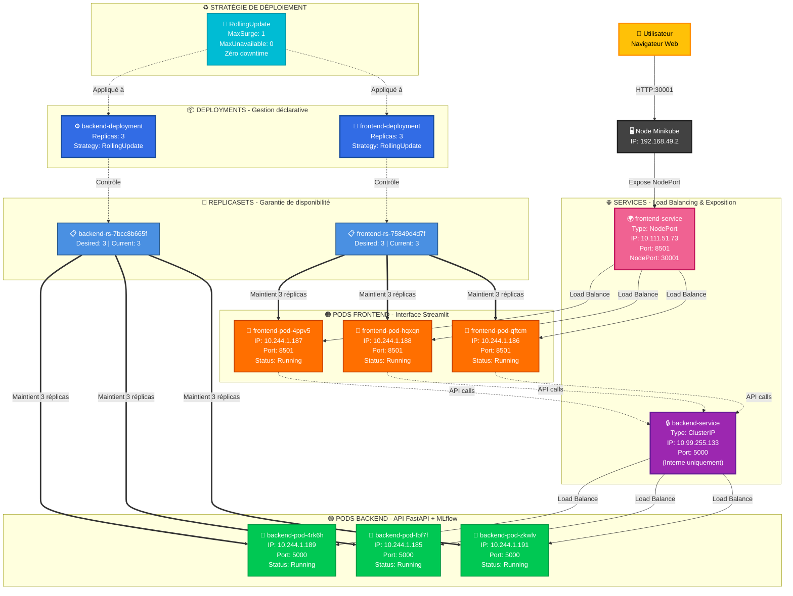

# 🚀 Architecture Kubernetes - Déploiement MLOps Crime Prediction

## 📊 Diagramme d'Architecture

> **Cluster Kubernetes** : Orchestration de microservices avec haute disponibilité (3 réplicas)  
> **Infrastructure** : Minikube (Node IP: `192.168.49.2`)



---

## 🎯 Explication des Composants

### 📦 **Deployments** (Déploiements)
- **Rôle** : Définissent l'état désiré de l'application (nombre de réplicas, image Docker, stratégie de mise à jour)
- **Backend** : 3 réplicas de l'API FastAPI + MLflow (prédictions de crimes)
- **Frontend** : 3 réplicas de l'interface Streamlit (interface utilisateur)
- **Stratégie** : RollingUpdate pour des mises à jour sans interruption de service

### 🔄 **ReplicaSets** (Ensembles de Réplicas)
- **Rôle** : Garantissent qu'un nombre spécifique de Pods identiques est toujours en cours d'exécution
- **Auto-guérison** : Si un Pod échoue, le ReplicaSet en crée automatiquement un nouveau
- **Contrôlé par** : Les Deployments (ne pas modifier manuellement)

### 🐳 **Pods** (Conteneurs applicatifs)
- **Backend Pods** (🟢 Vert) :
  - Image : `imen835/mlops-crime:backend-latest`
  - Port : 5000 (API FastAPI)
  - Fonctionnalités : Prédictions ML, gestion des modèles MLflow, Feature Store
  - IPs internes : 10.244.1.185, 10.244.1.189, 10.244.1.191

- **Frontend Pods** (🟠 Orange) :
  - Image : `imen835/mlops-crime:frontend-latest`
  - Port : 8501 (Streamlit)
  - Fonctionnalités : Interface utilisateur, visualisations, formulaires de prédiction
  - IPs internes : 10.244.1.186, 10.244.1.187, 10.244.1.188

### 🌐 **Services** (Exposition et Load Balancing)
- **backend-service** (🔒 ClusterIP - Violet) :
  - Type : `ClusterIP` (accessible uniquement à l'intérieur du cluster)
  - IP virtuelle : 10.99.255.133
  - Fonction : Équilibre la charge entre les 3 Pods backend
  - Utilisé par : Les Pods frontend pour appeler l'API

- **frontend-service** (🌍 NodePort - Rose) :
  - Type : `NodePort` (exposé à l'extérieur du cluster)
  - IP virtuelle : 10.111.51.73
  - Port interne : 8501
  - **NodePort : 30001** → Accessible via `http://192.168.49.2:30001`
  - Fonction : Point d'entrée pour les utilisateurs externes

### 🖥️ **Node Minikube** (Nœud du cluster)
- **IP externe** : 192.168.49.2
- **Rôle** : Serveur physique/virtuel qui héberge tous les Pods
- **Dans notre cas** : Cluster mono-nœud (Minikube pour développement/démo)

### ♻️ **RollingUpdate Strategy** (Stratégie de mise à jour)
- **Principe** : Mise à jour progressive des Pods (un par un ou par petits groupes)
- **Avantage** : Zéro downtime - l'application reste accessible pendant la mise à jour
- **Paramètres** :
  - `MaxSurge` : Nombre de Pods supplémentaires créés temporairement
  - `MaxUnavailable` : Nombre maximum de Pods indisponibles pendant la mise à jour

---

## 🔗 Flux de Communication

1. **Utilisateur** → Navigateur web (`http://192.168.49.2:30001`)
2. **NodePort 30001** → Redirige vers `frontend-service`
3. **frontend-service** → Load balance vers l'un des 3 Pods frontend (Streamlit)
4. **Frontend Pod** → Appelle `backend-service:5000` (communication interne)
5. **backend-service** → Load balance vers l'un des 3 Pods backend (FastAPI)
6. **Backend Pod** → Exécute la prédiction ML (modèle MLflow) et retourne le résultat

---

## 🚀 Accès à l'Application

### 🌍 Frontend (Interface Utilisateur)
```bash
# Récupérer l'URL publique
minikube service frontend-service --url

# Ouvrir dans le navigateur
xdg-open http://192.168.49.2:30001
```
**URL directe** : `http://192.168.49.2:30001`

### 🔧 Backend (API Swagger - Pour tests)
```bash
# Port-forward pour accès local
kubectl port-forward service/backend-service 5000:5000

# Accéder à la documentation Swagger
xdg-open http://127.0.0.1:5000/docs
```

---

## 📋 Commandes de Vérification (Pour la Démo)

```bash
# 1. Vérifier l'état des Pods
kubectl get pods -o wide

# 2. Vérifier les Deployments
kubectl get deployments

# 3. Vérifier les Services
kubectl get svc

# 4. Décrire un Pod Backend
kubectl describe pod <backend-pod-name>

# 5. Voir les logs en temps réel
kubectl logs -f deployment/backend-deployment

# 6. Simuler une mise à jour RollingUpdate
kubectl set image deployment/backend-deployment backend=imen835/mlops-crime:new-version
kubectl rollout status deployment/backend-deployment
```

---

## 🎨 Légende des Couleurs

| Couleur | Composant | Signification |
|---------|-----------|---------------|
| 🔵 Bleu | Deployments | Orchestration de haut niveau |
| 🔷 Bleu clair | ReplicaSets | Gestion des réplicas |
| 🟢 Vert | Pods Backend | Conteneurs API/ML |
| 🟠 Orange | Pods Frontend | Conteneurs Interface |
| 🟣 Violet | Service ClusterIP | Réseau interne |
| 🌸 Rose | Service NodePort | Exposition externe |
| ⚫ Noir | Node | Infrastructure |
| 🟡 Jaune | Utilisateur | Point d'entrée |
| 🔵 Cyan | Stratégie | Configuration déploiement |

---

**✨ Architecture conçue pour la scalabilité, la résilience et le déploiement continu (CI/CD)**